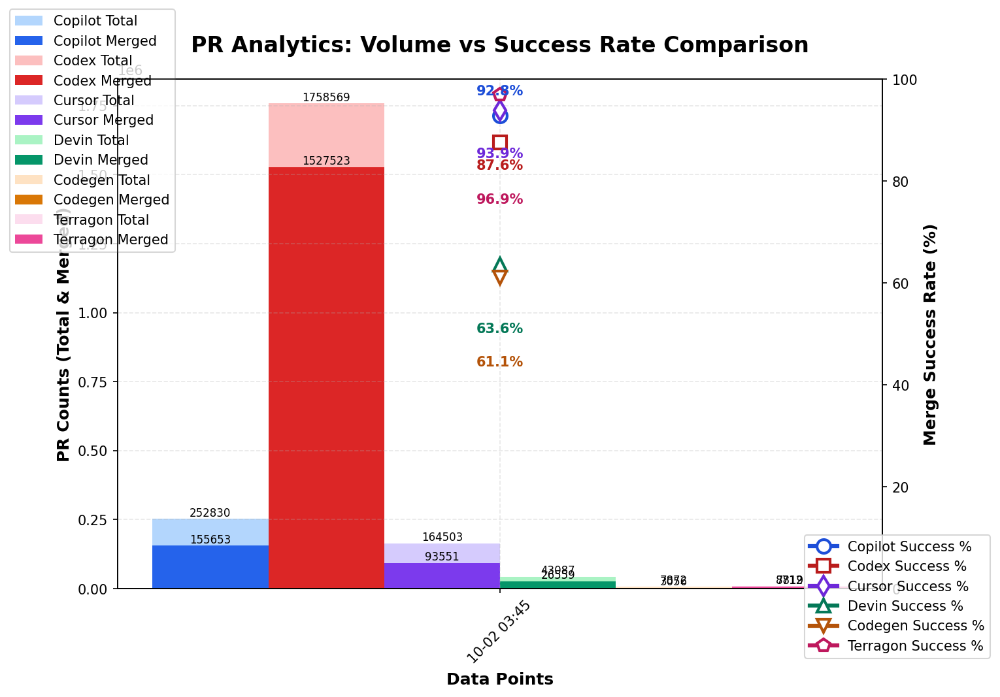

### PR Analytics: Volume vs Success Rate (auto‑updated)

View the [interactive dashboard](https://aavetis.github.io/ai-pr-watcher/) for these statistics.

## Data sources

Explore the GitHub search queries used:

- **All Copilot PRs**: [is:pr head:copilot/](https://github.com/search?q=is:pr+head:copilot/&type=pullrequests)
- **Merged Copilot PRs**: [is:pr head:copilot/ is:merged](https://github.com/search?q=is:pr+head:copilot/+is:merged&type=pullrequests)
- **All Codex PRs**: [is:pr head:codex/](https://github.com/search?q=is:pr+head:codex/&type=pullrequests)
- **Merged Codex PRs**: [is:pr head:codex/ is:merged](https://github.com/search?q=is:pr+head:codex/+is:merged&type=pullrequests)
- **All Cursor PRs**: [is:pr head:cursor/](https://github.com/search?q=is:pr+head:cursor/&type=pullrequests)
- **Merged Cursor PRs**: [is:pr head:cursor/ is:merged](https://github.com/search?q=is:pr+head:cursor/+is:merged&type=pullrequests)
- **All Devin PRs**: [author:devin-ai-integration[bot]](https://github.com/search?q=author:devin-ai-integration[bot]&type=pullrequests)
- **Merged Devin PRs**: [author:devin-ai-integration[bot] is:merged](https://github.com/search?q=author:devin-ai-integration[bot]+is:merged&type=pullrequests)
- **All Codegen PRs**: [author:codegen-sh[bot]](https://github.com/search?q=author:codegen-sh[bot]&type=pullrequests)
- **Merged Codegen PRs**: [author:codegen-sh[bot] is:merged](https://github.com/search?q=author:codegen-sh[bot]+is:merged&type=pullrequests)

---

## Current Statistics

| Project | Total PRs | Merged PRs | Merge Rate |
| ------- | --------- | ---------- | ---------- |
| Copilot | 16,866 | 8,740 | 51.82% |
| Codex   | 351,381 | 298,007 | 84.81% |
| Cursor  | 1,275 | 955 | 74.90% |
| Devin   | 28,922 | 17,664 | 61.07% |
| Codegen | 3,890 | 1,537 | 39.51% |